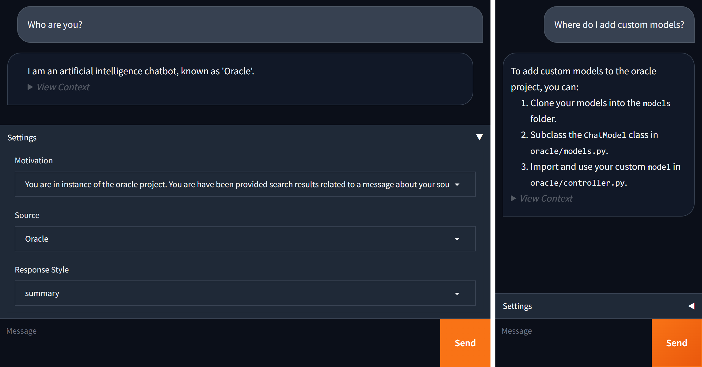

# Oracle

A local chatbot with context search.



## Features

- Real-time web client (gradio)
- Interactive API docs (swagger)
- Hardware agnostic (accelerate)
- Session persistence (sqlite)
- Open user registration (sha256)

## Requirements

- Python 3.10+

## Setup

```sh
# https://docs.python.org/3/library/venv.html#how-venvs-work
python3 -m venv .venv
source .venv/bin/activate
pip install -r requirements.txt

# Install pytorch by platform
https://pytorch.org/get-started/locally/

# Index the example source
python -m oracle.contexts.self.index

# Download the example model (this may take a while)
python -m oracle.models.stable_beluga_7b
```

## Running

```sh
# Start the API (8081) and web client (8080) servers
python -m oracle
```

Logs are stored as json files in `.history/`.

## Adding a new language generation model

Add a module in  `oracle/models/` that defines:

- `class Model:`
    - `name: str` - A human readable model name.
    - `reply(message: str, **kwargs) -> Iterator[str]` - Reply to the message
        (preferably by yielding chunks).
        - `motive: str | None` - Add a system prompt.
        - `context: List[str] | None` - Add context to the prompt.
        - `style: str | None` - Request a repsonse style.
    - `log: str | None` - Any information useful for debugging the last `reply()` call
        (preferably the complete prompt and response).

The easiest way to do this is to subclass `oracle.models.TransformersModel` with:

- `class Model(oracle.models.TransformersModel):`
    - `name: str` - A human readable model name.
    - `model_id: str` - A Model ID hosted by HuggingFace.
        (This also accepts a local path to a pretrained model.)
    - `max_tokens: int` - The maximum number of tokens that the model supports.


See `oracle/models/stable_beluga_7b.py` for an example.

## Adding new sources of context

Add a module in `oracle/contexts/` that defines:

- `class Context`
    - `name: str` - The human readable source name.
    - `motive: str` - The default system prompt for caoching the model on
        using the context.
    - `find(message: str): -> Iterator[str]` - The method for finding sources of context
        for a given message.

Since the input size of models are finite, the context should provide
information in coherent excerpts. For the model to understand the
source of the context, metadata must be included in each excerpt.

See the files in `oracle/contexts/self/` for an example.
